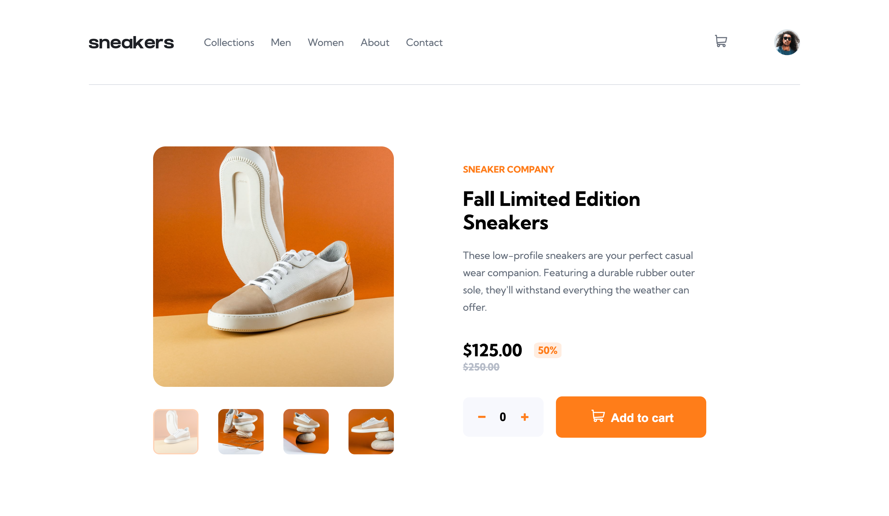

# 🚀 Frontend Mentor - E-commerce product page challenge

This is a solution to the [E-commerce product page challenge on Frontend Mentor](https://www.frontendmentor.io/challenges/ecommerce-product-page-UPsZ9MJp6).

### The challenge 💪🏻

Users should be able to:

- View the optimal layout for the app depending on their device's screen size
- See hover states for all interactive elements on the page
- Generate a new piece of advice by clicking the dice icon

### Screenshot 🖥

### Links 🔗

- Live Site URL: [Click here](https://carlotablanco.github.io/ecommerce-product-page)

### Built with 🛠

- Semantic HTML5 markup
- SCSS custom properties
- Flexbox
- Grid
- Javascript
- Mobile-first workflow

## Author 🖌

- Website - [Carlota Blanco](https://carlotablanco.es/)
